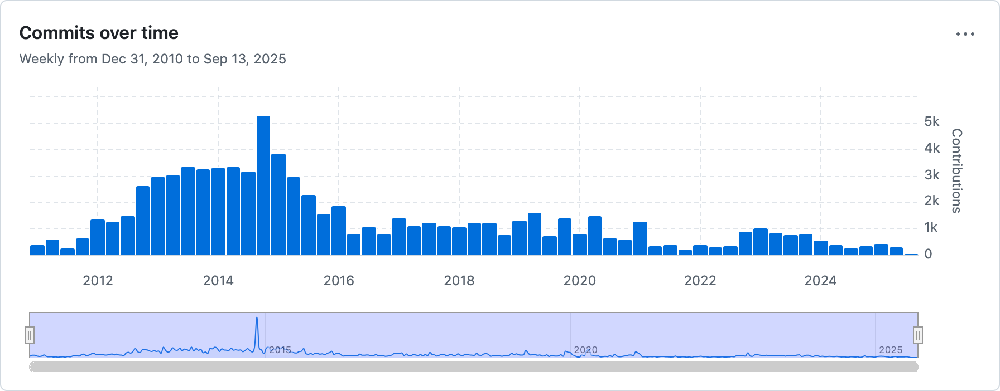

# Project Proposal: Team 3

This document outlines our team's proposal for the project, focusing on the security analysis of a chosen open-source project.

---

### **1. Team Collaboration & Project Management**

**Public GitHub Repository:**
https://github.com/smfarjad/CYBR8420_Team3

**GitHub Project Board:**
https://github.com/users/smfarjad/projects/3

---

### **2. Open-Source Software Selection**

**Software Name:**
Salt

**Repository Link:**
https://github.com/saltstack/salt

---

### **3. Hypothetical Operational Environment & Security Analysis**

**Operational Environment Description:**  
Salt can hypothetically operate in enterprise environments with hybrid cloud and on-premise infrastructure (e.g., edge computing environments), where system administrators, DevOps, security, and infrastructure teams manage hundreds to thousands of nodes (servers, VMs, network devices). It ensures consistent system states, enforces strict security policies (e.g., encryption, authorization, compliance), and maintains high uptime with recovery capabilities for network or node failures. The nodes are referred to as minions and are managed by a central server(s) called the master.

**Systems Engineering View Diagram:**

**Threats:**  
For this operational environment, the perceived threats are as follows:
1. Unauthorized access to master or minion; key compromise.  
2. Eavesdropping or MITM attacks on the transport.  
3. Malicious state or execution modules (supply-chain or plugin).  
4. Misconfiguration leading to privilege escalation.  
5. DoS or overload from too many events or nodes.  
6. Configuration drift or divergence.
7. Data tampering  

**Security Features:**  
Following are the key security features, which are used by Salt, these security features enable safe operations of the system.

- **Encrypted Communication:** Salt uses AES for encrypting the communication channel between central control server (i.e., master) and its connected nodes (i.e., minions). Besides communication, it uses encryptiion  
- **External Authentication:** For providing external authnetication, salt allows login via PAM, GitHub, etc., for user-based access. 
- **Encrypted Pillars:** The senstive data is stored in in encrypted form.   
- **Job Logging and Auditing:** The logging is ensured for tracking the history and details of the commands used by the users.
- **PKI Authentication:** Salt uses public/private keys to authenticate minions to the master. 
- **Minion Blacklist/Whitelist:**  Salt also maintains list for blocking unauthorized minions from connecting the master. 
- **Role-Based Access Control:** The users are constrained by permissions pertinent to their assigned roles.

### Security Features Documentation
https://docs.saltproject.io/salt/user-guide/en/latest/topics/security.html#

---

### **4. Project Motivation & Description**

**Team Motivation for Selection:**
We chose Salt for the project because it offers a rich setting in which to explore software assurance: a) it is relevant to current trends in infrastructure automation and DevOps; b) it poses clear challenges around security, consistency, and reliability; and c) it provides opportunities for hands-on work with tools used in production environments. Another key factor in our selection was the programming language of the codebase. Since our entire team is already familiar with Python, projects with a Python codebase were a high priority.

**Project Description:**
* **What is it?**: Salt (also known as SaltStack) is an event-driven automation and configuration management framework. It is used to deploy, configure, and manage complex IT systems, ensuring that all components maintain a consistent, desired state.
* **Contributors**: The project has over 2,400 community contributors. Major feature releases occur every 4-6 weeks, followed by subsequent bugfix and maintenance releases.
* **Activity**: The project has substantial ongoing community maintenance, active issue tracking, and consistent contributions via pull requests.
* **Use & Popularity**: Salt is widely used in the industry for infrastructure management, configuration drift prevention, orchestration, and automating routine tasks. Alongside Puppet, Chef, and Ansible, it is considered one of the most mature tools in its field.
* **Languages Used**: The codebase is written primarily in Python. Configuration states are typically written in YAML and can be extended with templating engines like Jinja.
* **Platform**: Salt runs on Unix-like systems (Linux, BSD), macOS, and Windows. It can manage a wide range of components, including servers, containers, virtual machines, databases, and network devices.
* **Documentation Sources**: [docs.saltproject.io](https://docs.saltproject.io)

**Additional Project Statistics:**
- **Commits:** The main repository has accumulated over 79,600 commits, reflecting a long history of continuous development.
- **Open Issues:** Currently, there are 2,239 open issues, which indicates a high level of user engagement and ongoing bug discovery.
- **Recent Activity:** Development remains active, with regular bug reports and pull requests. The project also had a recent Long-Term Support (LTS) release, v3006.10, in March 2025, which underscores its continued maintenance and stability.

---

### **5. License & Contribution Procedures**

**Software License:**
**License:** Apache 2.0  
**Security Policy:** SECURITY.md file: public security announcement channel.

Permissive license allowing use, modification, and redistribution (including commercial). Conditions include retention of copyright/NOTICE and inclusion of the license text. The license provides an express patent grant and disclaims warranties; trademarks are not granted.

Contribution procedures.
- 	Issue selection: Contributions typically start from issues labeled help wanted or good first issue in the repository.
-   Branching model: Fork the repository and create a topic branch. Bug fixes target the oldest supported branch where the bug exists; new features and enhancements target master.
- 	Tooling & quality gates: Enable pre-commit hooks and run nox sessions locally; tests and documentation accompany changes when applicable.
- 	Pull requests: Submit a PR on GitHub and iterate based on reviewer feedback in accordance with the project’s Git/PR policy.
- 	Community standards: The Salt Project Code of Conduct applies to all participation.

Contributor agreements (CLA/DCO).

A mandatory CLA is not documented for the core saltstack/salt repository. Certain related repositories within the Salt/VMware/Broadcom ecosystem may require a CLA; when applicable, an automated check prompts during PR creation.

Security reporting.
Private vulnerability disclosures are accepted at saltproject-security.pdl@broadcom.com. The security team coordinates triage, fixes/backports, and public advisories after remediation.

---

### **6. Security History**

**Security-Related History:**
Saltstack has experienced a number of security-related vulnerabilities over the years, this includes:

**CVE-2020-11651** 
- Salt-master process ClearFuncs did not properly validate method calls 
- Allowed remote users to access methods without authentication 
- Saltstack released patches 3000.2, 2019.2.4 

**CVE-2020-11652** 
- Allowed attackers to read/change files on the Salt master without logging in 
- Saltstack released patches 3000.2, 2019.2.4 

**CVE-2022-22967** 
- Discovered in Salstack Salt in versions before 3002.9, 3003.5, 3004.2 
- PAM authentication failed to block locked users 
- Resolved the issues in those versions 

**CVE-2022-22936** 
- Discovered in Salstack Salt in versions before 3002.8, 3003.4, 3004.1 
- Replay attack vulnerability, allowed attackers to resend old job messages, potentially gaining root access 
- Resolved the issues in those versions 
-Engineering & process: The project publishes security advisories, supports private vulnerability reporting, and since 3006 follows an LTS/STS release cadence to deliver fixes predictably.
-Bottom line: Strong security primitives but a broad attack surface avoid exposing masters to the internet, enable TLS/eAuth, disable auto-accept, and patch promptly.
-Known CVE for Saltstack Salt  https://nvd.nist.gov/vuln/detail/CVE-2020-11651  

### **7. Team Reflection**

As a team we learned how challenging yet rewarding it is to work with a large open-source project like Salt and to break down complex documentation into clear and accurate content. Each of us came away with different insights. Mohammed deepened his understanding of licensing, contribution flows, and the practical side of security patching. Farjad reflected on how commercial backing and external resources enhance open-source projects and the importance of clear communication. Tyler recognized how essential consistent communication is for coordinating tasks and timelines. Joe gained experience in working within a technical team, adapting to setbacks, and using GitHub more extensively. John learned the system-level setup of Salt and realized the importance of using the right tools and branches. Overall, the most useful lesson was seeing how effective collaboration, steady feedback loops, and open communication helped us stay organized and make progress even when we faced challenges.
