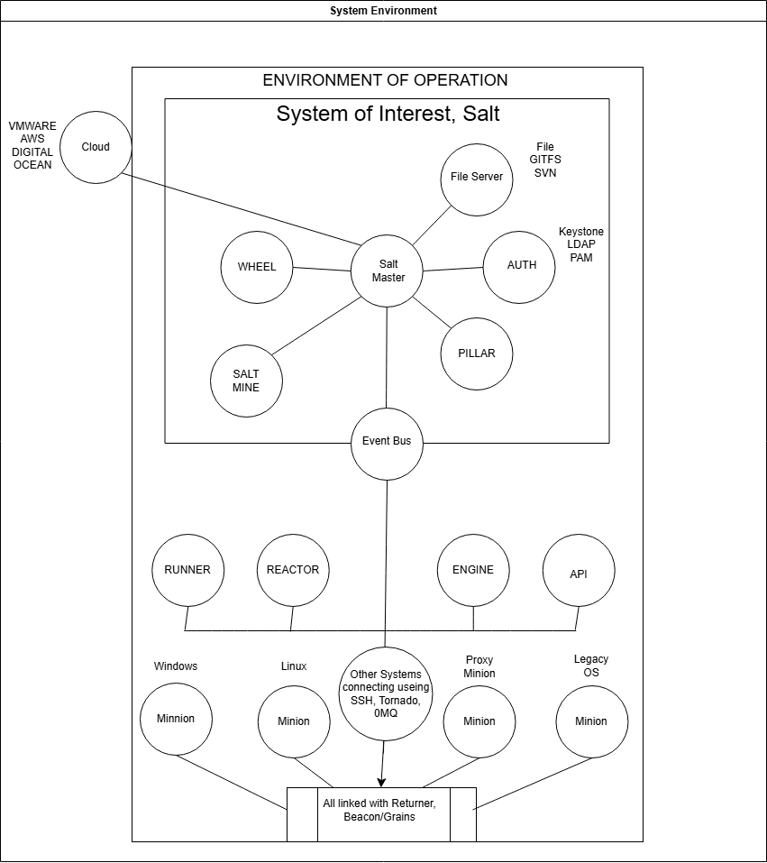

# Project Proposal: Team 3

This document outlines our team's proposal for the project, focusing on the security analysis of a chosen open-source software.

---

### **1. Team Collaboration & Project Management**

**Public GitHub Repository:**
https://github.com/smfarjad/CYBR8420_Team3

**GitHub Project Board:**
https://github.com/users/smfarjad/projects/3

---

### **2. Open-Source Software Selection**

**Software Name:**
Salt

**Repository Link:**
https://github.com/saltstack/salt

---

### **3. Hypothetical Operational Environment & Security Analysis**

**Operational Environment Description:**  
SaltStack can hypothetically operate in enterprise environments with hybrid cloud and on-premise infrastructure, where system administrators, DevOps, security, and infrastructure teams manage hundreds to thousands of nodes (servers, VMs, network devices). It ensures consistent system states, enforces strict security policies (e.g., encryption, authorization, compliance), and maintains high uptime with recovery capabilities for network or node failures.

**Systems Engineering View Diagram:**
[Insert a link to or embed an image of your systems engineering diagram here. The diagram should visually represent the software in its operational environment, showing its interactions with users and other systems.]

**Threats:**  
For this operational environment, the perceived threats are as follows:
1. Unauthorized access to master or minion; key compromise.  
2. Eavesdropping or MITM attacks on the transport.  
3. Malicious state or execution modules (supply-chain or plugin).  
4. Misconfiguration leading to privilege escalation.  
5. DoS or overload from too many events or nodes.  
6. Configuration drift or divergence.
7. Data tampering  

**Security Features:**  

AES Encryption- Encrpyts communication between master and minions  

External Authentication- Allows login via PAM, GitHub, etc., for user-based access 

Encrypted Pillars- Stores sensitive data in encrypted form   

Job Logging and Auditing- Tracks who ran what command, where they ran it, and when 

PKI Authentication- Uses public/private keys to authenticate minions to the master 

Minion Blacklist/Whitelist- Blocks unauthorized minions from connecting 

Role-Based Access Control- Limits what users can do based on roles and permissions 

### Security Features Documentation
https://docs.saltproject.io/salt/user-guide/en/latest/topics/security.html#

---

### **4. Project Motivation & Description**

**Team Motivation for Selection:**
We chose Salt for the project because it offers a rich setting in which to explore software assurance: it’s relevant to current trends in infrastructure automation and DevOps, poses clear challenges around security, consistency, and reliability, and gives us opportunities for hands-on work with real tools used in production environments.

**Open-Source Project Description:**
- **What is it?**: Salt (also known as SaltStack) is an event-driven automation and configuration management framework. It is used to deploy, configure, and manage complex IT systems, ensuring that all components maintain a consistent desired state.
- **Contributors**: The project has more than 3,000 contributors in its community. Releases are made frequently; feature releases occur every 4-6 weeks with subsequent bugfix or maintenance releases.
- **Activity**: There is substantial ongoing community maintenance, active issue tracking, and contributions via pull requests. 
- **Use & Popularity**:  Salt is widely used in industry for infrastructure management, configuration drift prevention, orchestration, and automating routine tasks. It is considered one of the mature tools alongside Puppet, Chef, Ansible. 
- **Languages Used**: Primarily Python. Configuration files/states are often written in YAML with support via templating (e.g. Jinja) etc. 
- **Platform**: Salt runs on Unix-like systems (Linux, BSD), macOS, and Windows. It manages servers, containers, virtual machines, databases, network devices, etc. 
- **Documentation Sources**: [docs.saltproject.io](https://docs.saltproject.io)

**Additional Project Statistics:**

- **Number of contributors:** Salt has more than 3,000 contributors to its GitHub repository.

- **Total commits:** The repository has over 108,300 commits on the main Salt repository. 

- **Open issues:** As of early September 2025, there are thousands of open issues—e.g. issues numbered in the 68,000s (e.g. #68311, #68308, etc.).

- **Recent activity:** Salt continues to have regular bug reports and pull requests. It also had a recent Long Term Support (LTS) release (v3006.10) in March 2025.

---

### **5. License & Contribution Procedures**

**Software License:**
**License:** Apache 2.0  
**Security Policy:** SECURITY.md file: public security announcement channel.

Permissive license allowing use, modification, and redistribution (including commercial). Conditions include retention of copyright/NOTICE and inclusion of the license text. The license provides an express patent grant and disclaims warranties; trademarks are not granted.

Contribution procedures.
- 	Issue selection: Contributions typically start from issues labeled help wanted or good first issue in the repository.
-   Branching model: Fork the repository and create a topic branch. Bug fixes target the oldest supported branch where the bug exists; new features and enhancements target master.
- 	Tooling & quality gates: Enable pre-commit hooks and run nox sessions locally; tests and documentation accompany changes when applicable.
- 	Pull requests: Submit a PR on GitHub and iterate based on reviewer feedback in accordance with the project’s Git/PR policy.
- 	Community standards: The Salt Project Code of Conduct applies to all participation.

Contributor agreements (CLA/DCO).

A mandatory CLA is not documented for the core saltstack/salt repository. Certain related repositories within the Salt/VMware/Broadcom ecosystem may require a CLA; when applicable, an automated check prompts during PR creation.

Security reporting.
Private vulnerability disclosures are accepted at saltproject-security.pdl@broadcom.com. The security team coordinates triage, fixes/backports, and public advisories after remediation.

---

### **6. Security History**

**Security-Related History:**

Saltstack has experienced a number of security-related vulnerabilities over the years, this includes:

**CVE-2020-11651** 

- Salt-master process ClearFuncs did not properly validate method calls 

- Allowed remote users to access methods without authentication 

- Saltstack released patches 3000.2, 2019.2.4 

**CVE-2020-11652** 

- Allowed attackers to read/change files on the Salt master without logging in 

- Saltstack released patches 3000.2, 2019.2.4 

**CVE-2022-22967** 

- Discovered in Salstack Salt in versions before 3002.9, 3003.5, 3004.2 

- PAM authentication failed to block locked users 

- Resolved the issues in those versions 

**CVE-2022-22936** 

- Discovered in Salstack Salt in versions before 3002.8, 3003.4, 3004.1 

- Replay attack vulnerability, allowed attackers to resend old job messages, potentially gaining root access 

- Resolved the issues in those versions 

-Engineering & process: The project publishes security advisories, supports private vulnerability reporting, and since 3006 follows an LTS/STS release cadence to deliver fixes predictably.

-Bottom line: Strong security primitives but a broad attack surface avoid exposing masters to the internet, enable TLS/eAuth, disable auto-accept, and patch promptly.

-Known CVE for Saltstack Salt  https://nvd.nist.gov/vuln/detail/CVE-2020-11651  

### **7. Team Reflection**

***Mohammed Alfawzan***

I learned how to read a large open source project and turn dense docs into clear, accurate text. Owning the License and Contribution Procedures section pushed me to understand Apache 2.0 in practical terms, the normal contribution flow for Salt from fork and branch to running pre commit and nox and opening a pull request, how security issues are reported privately before advisories, and why the LTS and STS release rhythm matters for patching. I also got better at connecting a systems view and threat model to real CVEs and at keeping work organized with a GitHub project board that links issues and reviews. The most useful part was the fast review loops with the team, which tightened my writing and made the whole process move smoothly.

***Sheikh Muhammad Farjad***
- **What did you learn?**: [Your personal learning experience from this assignment.]
- **What did you find most useful?**: [The most valuable part of the process for you.]

***Tyler McCoid***  
For this assignment, I didn’t anticipate the sheer number of different open-source projects that are being worked on in the community and many of the larger ones are actively being supported by large corporations. With this assignment, I learned that communication is key for coordinating with who is working on what and the timeline for when things need to be done. The most useful point that I learned from this assignment is that having a good communication channel to the rest of the team makes everything run a lot smoother.  

***Joe Nguyen***

This is my first time being a part of a technical team and I learned quite a lot from the experience. At first it was very overwhelming- having to find a meeting time that worked for everyone, distributing the work, and coming up with a project. Even though this was just a project proposal, I can already see how technically complex and detailed these kinds of projects can be. Another thing I learned was using GitHub, I have used it before but not to this extent. One issue that we ran into was during our meeting with Dr. Gandhi. He mentioned that our original project idea would not work well. This did set us back a bit, as some team members had already started working on their parts, and we had to meet again to brainstorm a new project idea. However, we were able to communicate effectively and quickly align on a new project. What I found most useful was the regular communication within the team. Keeping each other updated helped us stay on track, adjust when needed and avoid misunderstandings.     

***John Winchester***
- **What did you learn?**: Draw.IO is a infuriating program. I learned alot of how SALT is set up on a systems level, atleast I believe so. I would be happy to get confirmation or clarification on how certain environment variables are set up within the operational environment, system of interest, or OUTSIDE the system of interest. 
- **What did you find most useful?**: Github projects, and in voice communication. From a software security perspective, the extensive documentation and open source transparency is quite useful. I was working on the wrong branch, and wrong file for quite some time till I noticed a lot more activity to where it was supposed to be. 
