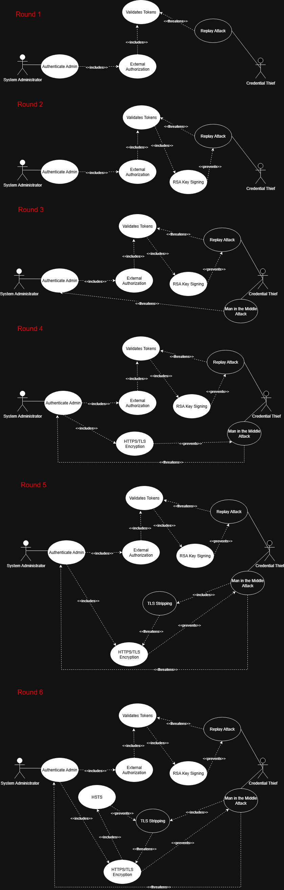

# Assignment Part 1

## 1. Five Essential Interactions (Use/Misuse Cases)

### 1.1 Use Case 1 - Manage Pillars (Contributor: Sheikh Muhammad Farjad)

**Derived Security Requirements:**
- **SR-01:** Blah blah blah
- **SR-02:** Blah blah blah

### 1.2 Use Case 2 - Authentication/Authorization System (Contributor: Joe Nguyen)

**Derived Security Requirements:**
- **SR-03:**
- **SR-04:**

### 1.3 Use Case 3 - Remote Deployment (Contributor: Mohammed Alfawzan)

**Derived Security Requirements:**
- **SR-05:**  Artifact Encryption & Integrity Verification
All artifacts and configuration pillars staged to targets must be stored encrypted at rest (via Salt’s GPG renderer or Vault integration) and verified with cryptographic digests/signatures at deployment time.
Rationale: Prevents Artifact Poisoning by ensuring only authentic, untampered artifacts are applied
- **SR-06:**  Deployment Verification & Rollback Trigger
Every remote deployment must be followed by automated verification checks (service health, integrity tests). If verification fails, the system must automatically initiate Rollback & Remediation to the last-known-good state.
Rationale: Prevents Unauthorized/Unstable Production Deployment from persisting by detecting issues immediately and restoring stability.

### 1.4 Use Case 4 - Your Use Case (Contributor: Tyler McCoid)

**Derived Security Requirements:**
- **SR-07:** 
- **SR-08:** 

### 1.5 Use Case 5 - Your Use Case (Contributor: John Winchester)

**Derived Security Requirements:**
- **SR-09:** 
- **SR-10:** 

**2. Team Reflection**

**Mohammed Alfawzan**
**Sheikh Muhammad Farjad**
**Tyler McCoid**
**Joe Nguyen**
**John Winchester**

# Assignment Part 2

### Sheikh Muhammad Farjad:

### Joe Nguyen:

### Mohammed Alfawzan:

### Tyler McCoid:

### John Winchester:

